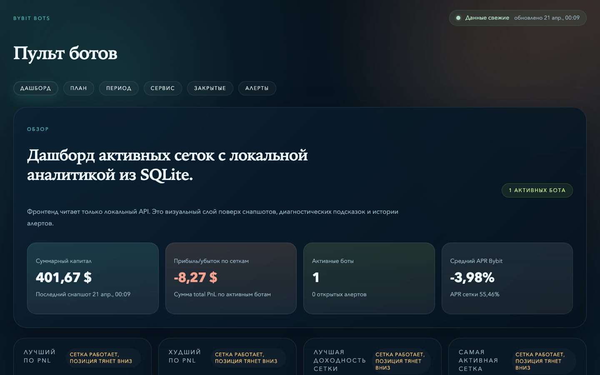
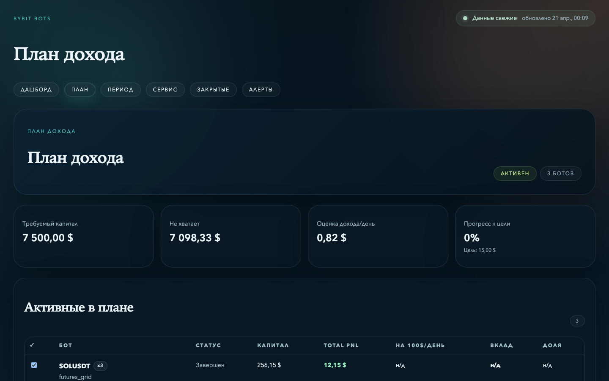
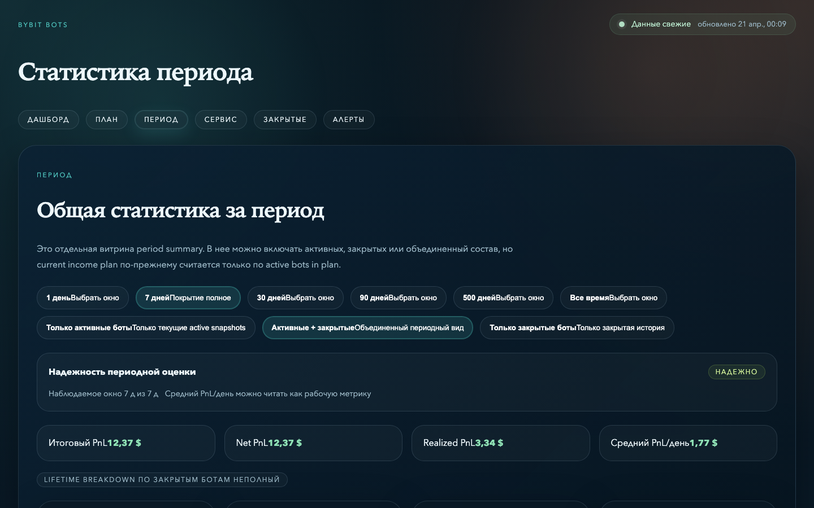
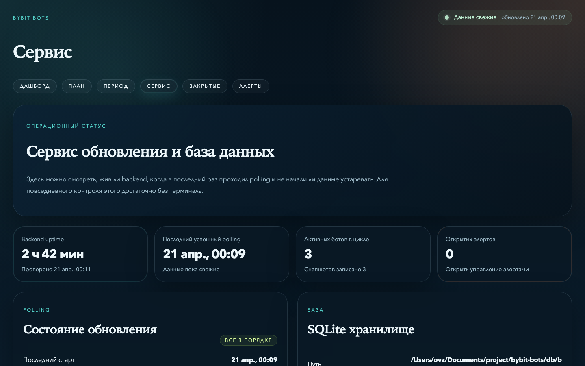
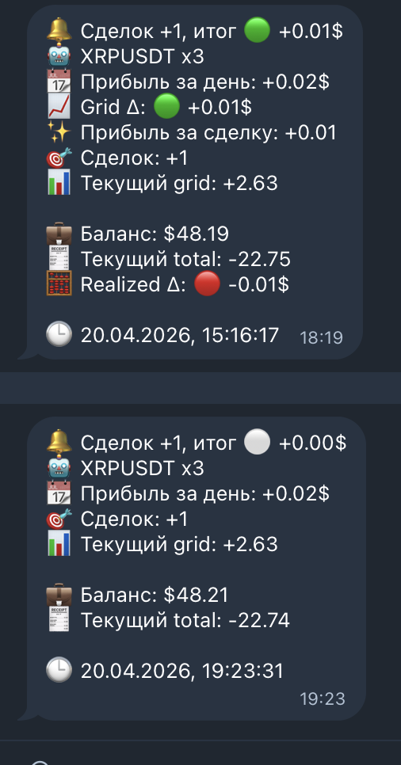

# bybit-bots

Личный трекер фьючерсных грид-ботов [Bybit](https://bybit.com) — локальный дашборд, история снапшотов, алерты и планирование дохода.

---

## Скриншоты












---

## Стек

| Слой | Технологии |
|---|---|
| Backend | NestJS 11 · Prisma 6 · TypeScript 5 · Winston |
| Frontend | React 18 · Vite 5 · Tailwind CSS 4 · Chart.js · Lightweight Charts |
| База данных | SQLite (через Prisma + better-sqlite3) |
| Автозапуск | macOS launchd |
| Качество кода | ESLint · TypeScript strict |

---

## Возможности

- **Инвентарь ботов** — отслеживает все известные фьючерсные грид-боты Bybit по `bot_id`
- **История снапшотов** — снапшоты каждые 5 минут; дедупликация для завершённых ботов
- **Дашборд** — сводка по активным ботам: PnL, APR, grid APR
- **Алерты** — настраиваемые правила по total PnL на бота; подтверждение / подавление
- **План дохода** — оценка текущего дня + статистика за периоды (1д / 7д / 30д / 90д) с проверкой покрытия
- **Telegram-уведомления** — push-уведомления при каждой сделке бота: символ и плечо, прибыль за день, delta grid PnL с цветовым индикатором (🟢/🔴), количество сделок, текущий grid PnL, баланс и total PnL. Настраивается через интерфейс.
- **Swagger UI** — автогенерируемая документация API по адресу `/api-docs`

---

## Архитектура

```
bybit-bots/
├── backend/          # NestJS + Prisma API (порт 3100)
├── web/              # React + Vite фронтенд (порт 5173)
├── legacy/           # Оригинальный Node.js runtime (bridge-слой)
├── scripts/          # CLI-скрипты: refresh, snapshot, report
├── db/               # SQLite база + SQL-схема
└── ops/launchd/      # macOS autostart plist
```

Основной API — NestJS backend. Слой `legacy/` сохранён как bridge на время миграции.

---

## Быстрый старт

**Backend**

```bash
cd backend
cp .env.example .env
npm run prisma:generate
npm run start
```

Слушает на `127.0.0.1:3100`.

**Frontend**

```bash
cd web
npm install
npm run dev
```

Слушает на `127.0.0.1:5173`, проксирует `/api` → backend.

---

## Разработка

```bash
# Проверка типов
cd web && npx tsc --noEmit

# Линтер
cd web && npm run lint

# Тесты
cd web && npm run test

# Сборка
cd web && npm run build
```

---

## Переменные окружения

| Переменная | Описание |
|---|---|
| `BYBIT_API_KEY` | API-ключ Bybit |
| `BYBIT_API_SECRET` | API-секрет Bybit |
| `BYBIT_ENV` | `mainnet` или `testnet` |
| `BOT_API_HOST` | Хост backend (по умолчанию `127.0.0.1`) |
| `BOT_API_PORT` | Порт backend (по умолчанию `3100`) |
| `SNAPSHOT_POLLING_ENABLED` | Включить встроенный polling (по умолчанию `true`) |
| `SNAPSHOT_POLLING_INTERVAL_MS` | Интервал polling в мс (по умолчанию `300000`) |

Значения также подхватываются из `~/.zshrc`, если не заданы в окружении.

---

## API

```
GET  /health
GET  /service/status
GET  /bots
GET  /bots/:id
GET  /bots/:id/snapshots
GET  /dashboard/summary
GET  /alerts
PUT  /alerts/:id/acknowledge
PUT  /alerts/:id/suppress
GET  /settings/telegram-alerts
PUT  /settings/telegram-alerts
GET  /settings/alert-rules
PUT  /settings/alert-rules/:botId/total-pnl
GET  /plans/current
PUT  /plans/current
PUT  /plans/current/bots/:botId
GET  /metrics
```

Swagger UI: `http://127.0.0.1:3100/api-docs`

---

## Скрипты

```bash
# Обновить данные ботов из Bybit API
node scripts/refresh_bybit_bots.js --api-only

# Отчёт по активным ботам с APR
node scripts/report_active_bots.js

# Сохранить снапшот активных ботов
node scripts/snapshot_active_bots.js
```

---

## Автозапуск (macOS launchd)

```bash
cp ops/launchd/local.bybit-bots.backend.plist ~/Library/LaunchAgents/
launchctl bootstrap gui/$(id -u) ~/Library/LaunchAgents/local.bybit-bots.backend.plist
launchctl kickstart -k gui/$(id -u)/local.bybit-bots.backend
```

Логи: `db/tmp/launchd-backend.stdout.log` / `db/tmp/launchd-backend.stderr.log`

---

## База данных

SQLite по пути `db/bybit-bots.sqlite`. Основные таблицы:

| Таблица | Описание |
|---|---|
| `bot_inventory` | Все известные боты: статус, символ, тип |
| `completed_fgrid_stats_history` | История снапшотов завершённых фьючерсных грид-ботов |
| `bots` | Снапшоты активных ботов (управляется Prisma) |
| `bot_snapshots` | Временные ряды снапшотов по каждому боту |

```sql
-- Активные боты
SELECT bot_id, symbol, status FROM bot_inventory WHERE status LIKE '%RUNNING%';

-- Последние снапшоты завершённых ботов
SELECT bot_id, symbol, total_pnl, apr, snapshot_at
FROM completed_fgrid_stats_history ORDER BY snapshot_id DESC;
```

---

## Заметки

- Эндпоинт `list-all-bots` Bybit часто возвращает `403` в CLI-контексте — обнаружение ботов опирается на известные `bot_id` из локальной БД
- `fgridbot/detail` по известному `bot_id` работает стабильно
- Плечо (`x2`, `x3`) берётся из raw-ответа `fgridbot/detail`
- Статистика за 7д / 30д / 90д требует почти полного покрытия периода, иначе считается недоступной
